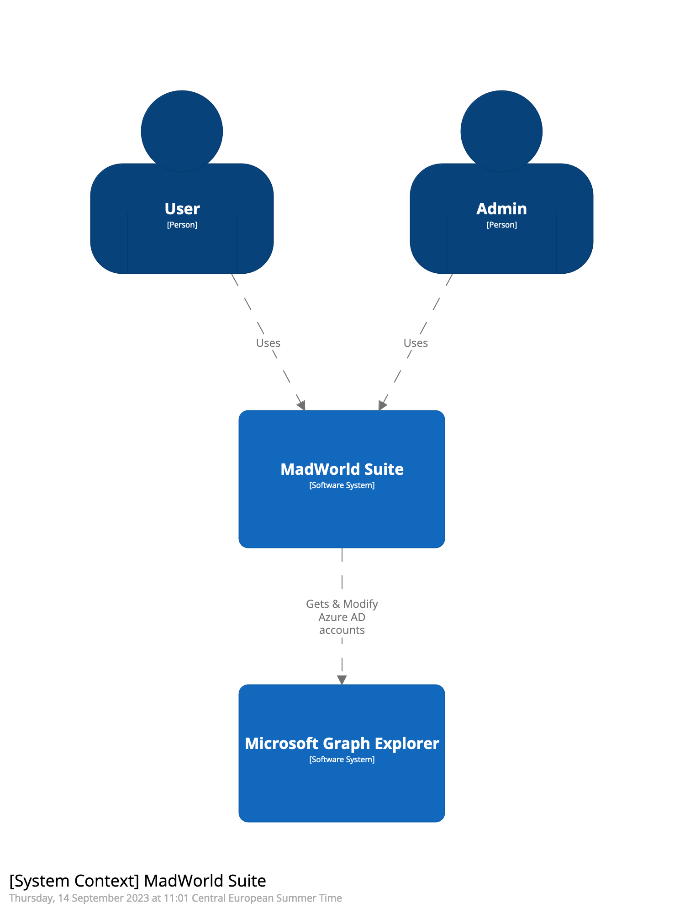
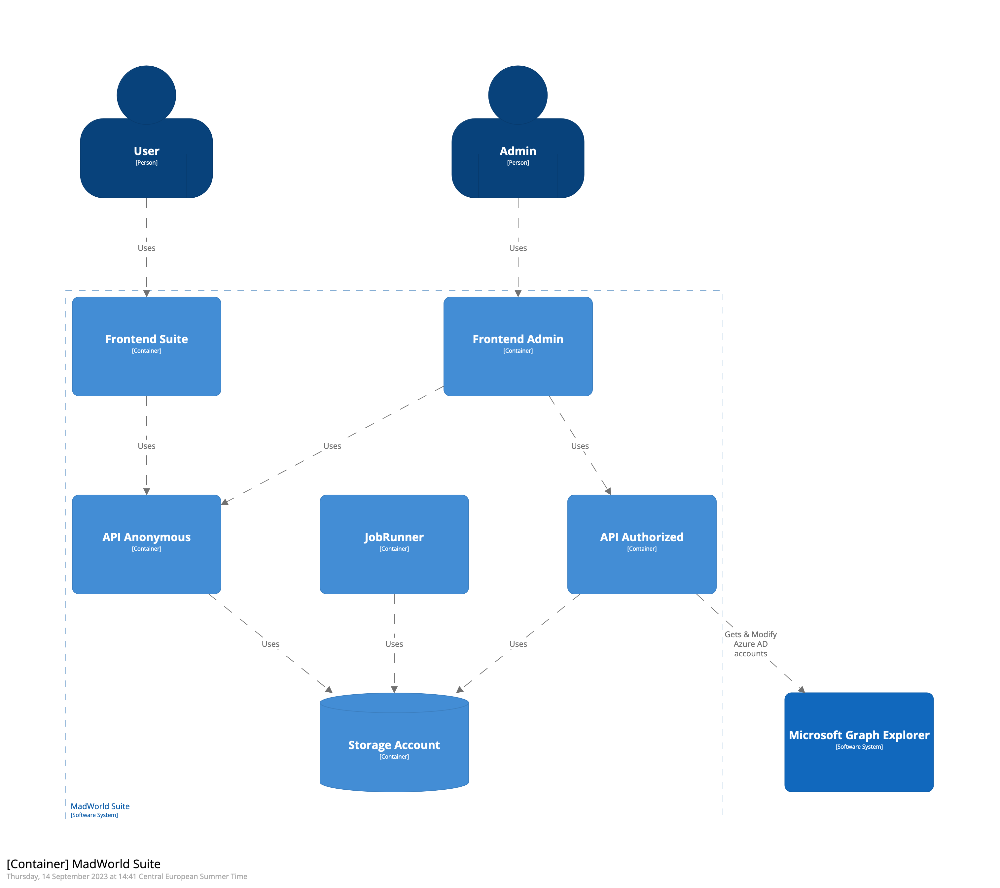

# C4 Models
C4 models, short for "Context, Containers, Components, and Code," provide a structured and scalable approach to visualizing 
and documenting software architecture, making them an invaluable tool for project teams aiming to improve system understanding 
and communication.

## System Context


## Container Context


## Use Structurizr to generate the diagrams
Start the Structurizr lite docker container:
``` shell
docker pull structurizr/lite
docker run -it --rm -p 8080:8080 -v PATH:/usr/local/structurizr structurizr/lite
```
Change PATH to your workspace directory

Visit http://localhost:8080/workspace/diagrams to start the structurizr lite web application.

Use visual code to edit the workspace file.

## Reference
* [Structurizr Install Guide](https://docs.structurizr.com/lite/installation)